# Bomberman

This game is an ongoing group project at my university, written in C#, WPF, with MVVM architecture.

## About the game
In Bomberman, there are 2 players on a 2D map, with walls, boxes and monsters. The players can move around the map, and place bombs that explode after 2 seconds. The walls are indestructible, while the players and monsters are killed by the explosions. When a box explodes, it either disappears or drops a powerup, but it stops the explosion from spreading. The enemies move around the map randomly, and kill the players if they step on the same field. A player wins a round if they are the last one surviving. The goal is to be the first one to get to 3 or 5 wins, depending on the user's choice!
Extras:
 - **Powerups:**
     - PLUSBOMB: The number of placable bombs increase by 1.
     - PLUSRANGE: The range of explosions increase by 1.
     - MINUSSPEED: The speed of the player is lowered for 10 seconds.
     - ONERANGE: The explosions' range lower to 1 field for 10 seconds.
     - NOBOMB: The player can't place bombs for 10 seconds.
     - INSTANTPLACEMENT: The player instantly places their bombs when on a valid field instead of placing it on keypress (for 10 seconds).
 - **3 Player gamemode:** a 3 player gamemode is also possible when starting a new game.
 - **Persistence:** the possibility of saving and later loading and continuing a game exactly where you left it!
 - **Custom settings:** the players can set their own preferred keybinds, so you decide how you want to control your character!
 - **Battle Royale:** the walls around the map are moving closer to you! Every round is shorter than the previous one, so the other players and monsters are not the only things you should look out for!

 ## Check out the demo video by clicking on the image!

[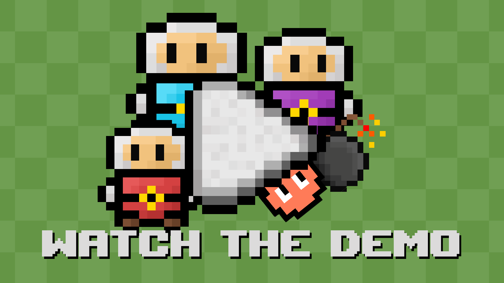](https://youtu.be/Rtt7uDtYgdU)

## My tasks
In this project my tasks were the following:
 - Prepare class diagram of the model layer of the software
 - Prepare UI plans
 - Draw all final pixel art UI elements (button designs, background images, fonts, animated sprites)
 - Implement player steps (validate and update)
 - Implement explosions (handle deaths, slow spread of explosion, box explosions, etc.)
 - Implement Battle Royale logic (handle timing, handle bombs stuck in walls, deaths, etc.)
 - Handle box explosions (stop explosion spread, drop powerup with 40% chance)
 - Implement all powerups (implement the logic and effect of all 6 powerups, timing of powerups, etc.)
 - Implement custom settings page and the logic of setting, saving and loading custom keybinds
 - Implement starting page
 - Implement game page (game itself, buttons, display of player wins, chat log)
 - Implement chat log, where messages about powerups, wins, and battle royale shrinks are displayed
 - Test player steps, explosions, powerups
All the code containing those logics mentioned above are mine, organised and commented with a relatively high detail.

## UI Plan and final design
### Plan
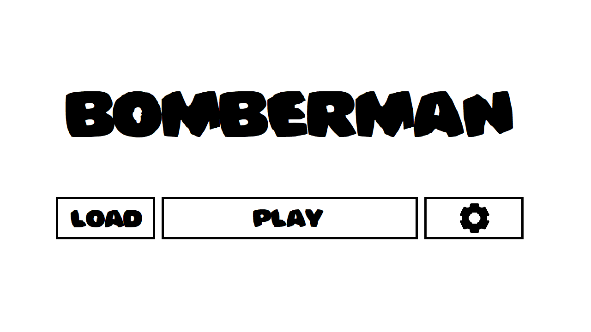
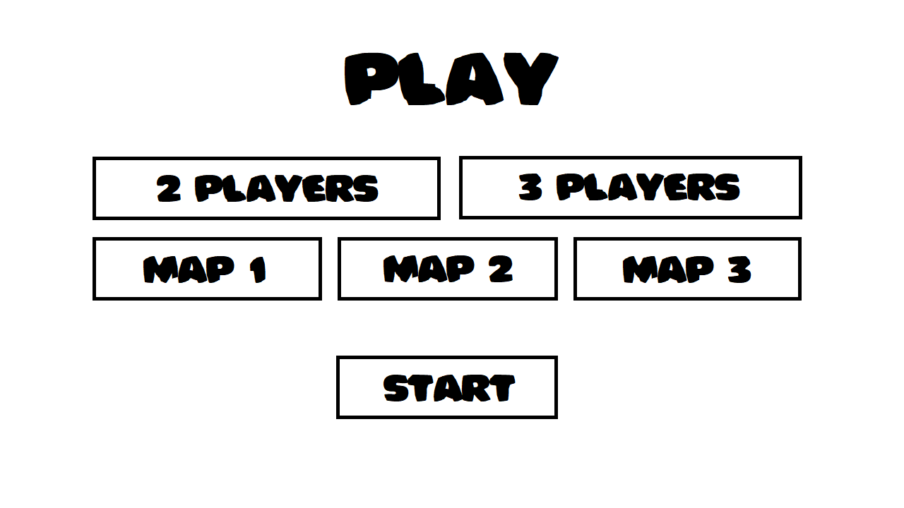
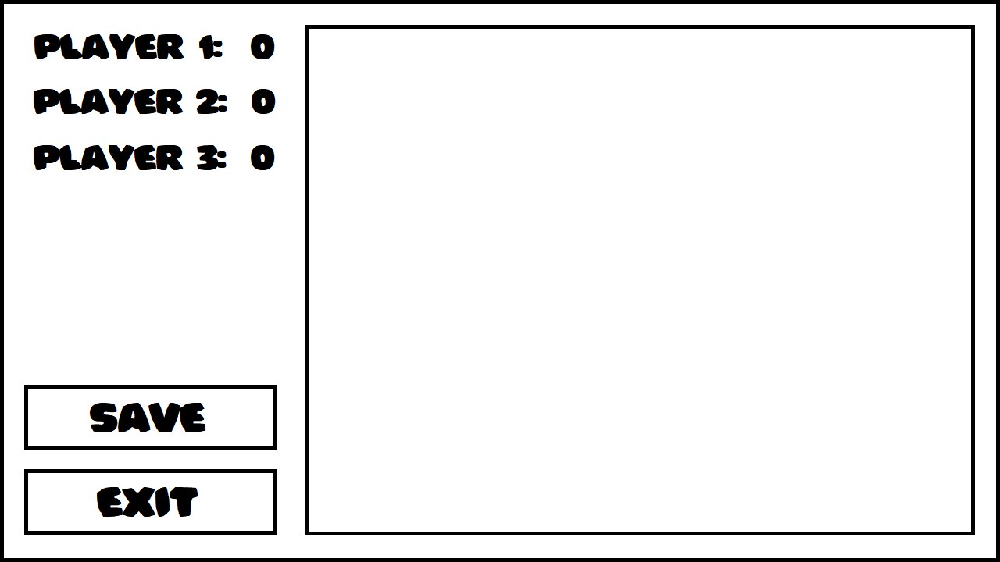
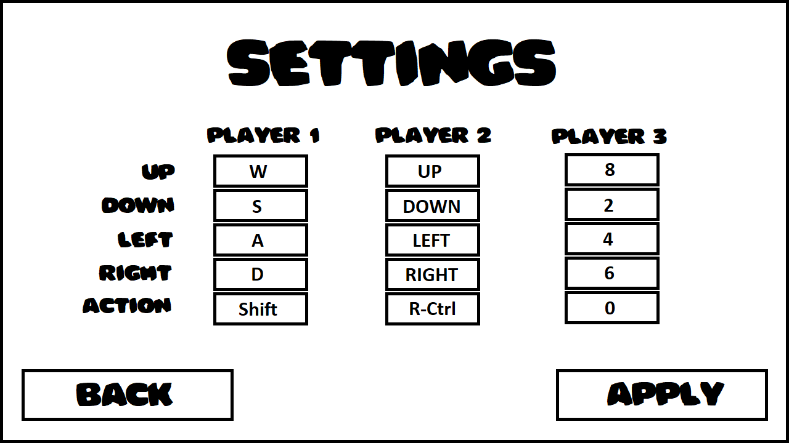

### Final
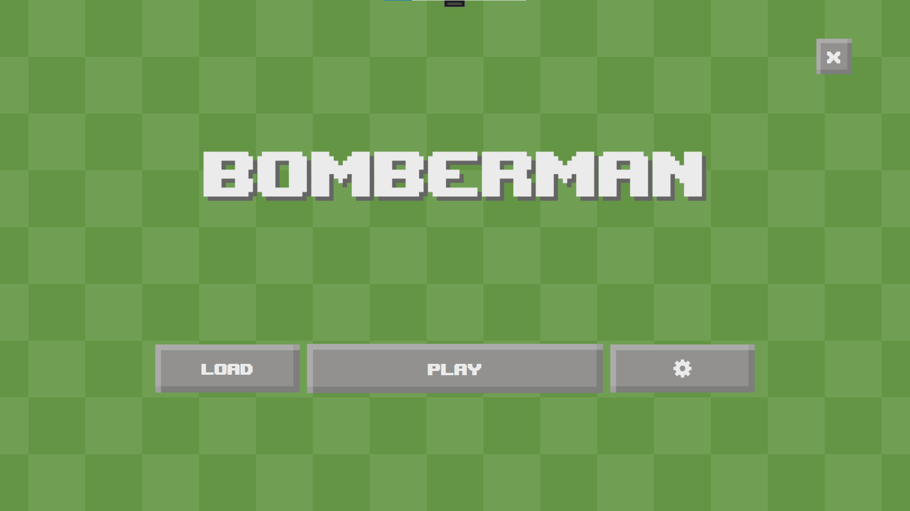
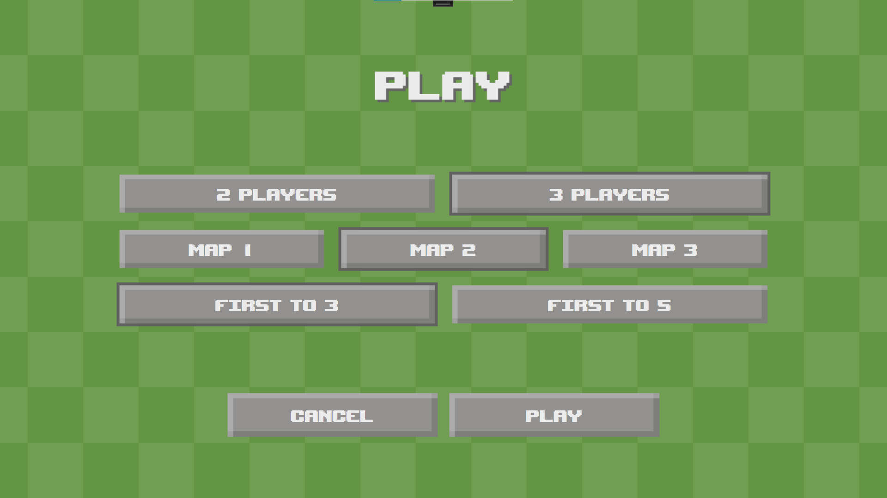

**Note:** the sprites Player, Bomb, Explosion and Powerup are animated.
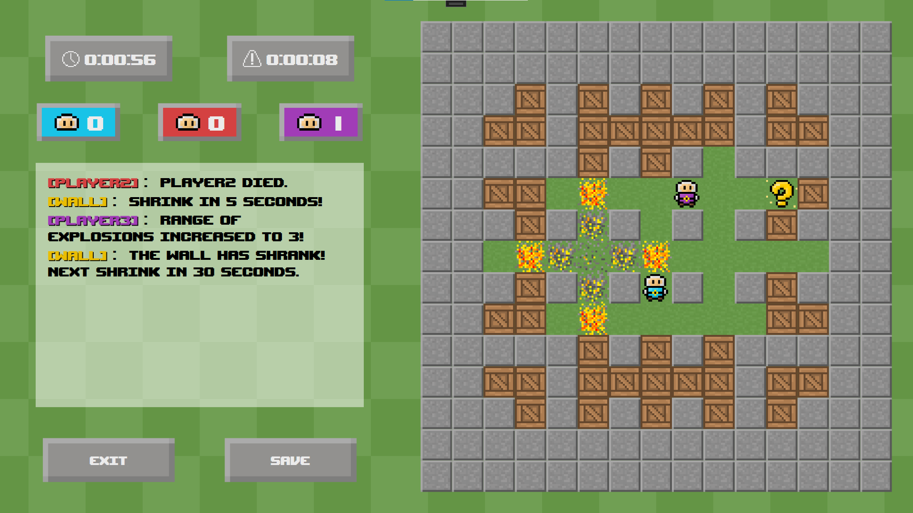
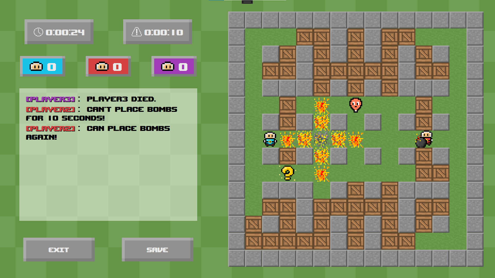
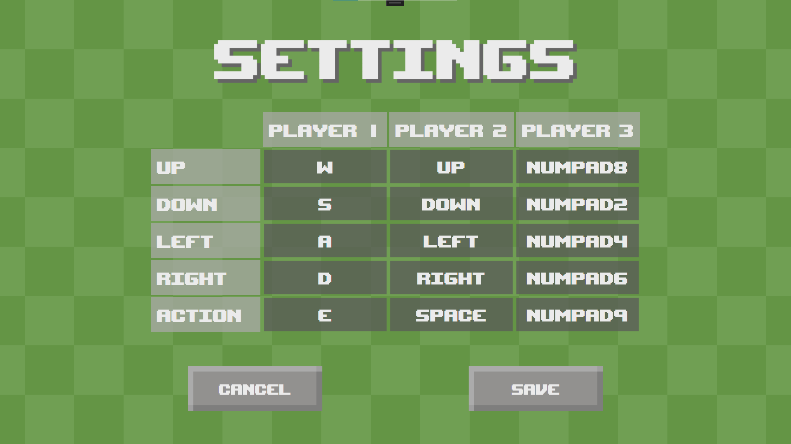
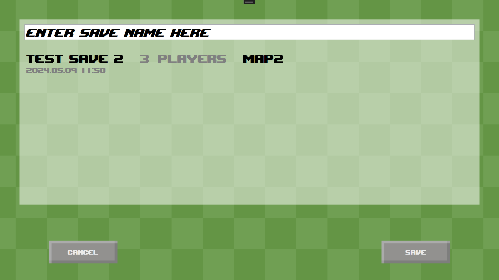

## Documentation
The documentation (use case diagram; class diagrams for model, view and viewmodel layers; package diagram) are not yet uploaded here.

## Results
The project was so successful, that the teacher decided to nominate it to the 'Hall of Fame', which showcases the best projects made in every semester. The process is still ongoing (we need to license every asset, etc.) and the results will be posted in a few weeks.

## Assets used

### Fonts
 - [UpheavalTT](https://www.dafont.com/upheaval.font) - [Brian Kent](http://www.aenigmafonts.com/) ([license](Bomberman/Bomberman/Files/upheaval.txt))

### Textures
 - [Background](Bomberman/Bomberman/Textures/background_green_2550x1350_150.png) - Janik Bálint Áron
 - [Button texture 01](Bomberman/Bomberman/Textures/button_gray_100x100.png) - Janik Bálint Áron
 - [Button texture 02](Bomberman/Bomberman/Textures/button_gray_300x100.png) - Janik Bálint Áron
 - [Button texture 03](Bomberman/Bomberman/Textures/button_gray_450x100.png) - Janik Bálint Áron
 - [Button texture 04](Bomberman/Bomberman/Textures/button_gray_600x100.png) - Janik Bálint Áron
 - [Button texture 05](Bomberman/Bomberman/Textures/button_gray_700x100.png) - Janik Bálint Áron
 - [Button texture 06](Bomberman/Bomberman/Textures/button_gray_highlight_100x100.png) - Janik Bálint Áron
 - [Button texture 07](Bomberman/Bomberman/Textures/button_gray_highlight_300x100.png) - Janik Bálint Áron
 - [Button texture 08](Bomberman/Bomberman/Textures/button_gray_highlight_450x100.png) - Janik Bálint Áron
 - [Button texture 09](Bomberman/Bomberman/Textures/button_gray_highlight_600x100.png) - Janik Bálint Áron
 - [Button texture 10](Bomberman/Bomberman/Textures/button_gray_highlight_700x100.png) - Janik Bálint Áron
 - [Playtime icon](Bomberman/Bomberman/Textures/time_icon_16x16.png) - Janik Bálint Áron
 - [Shrinktime icon](Bomberman/Bomberman/Textures/exclamationmark_icon_16x16.png) - Janik Bálint Áron
 - [Settings icon](Bomberman/Bomberman/Textures/settings.png) - Janik Bálint Áron
 - [Player head](Bomberman/Bomberman/Textures/head_13x13.png) - Janik Bálint Áron
 - [Player 1 wins](Bomberman/Bomberman/Textures/player1_200x100.png) - Janik Bálint Áron
 - [Player 2 wins](Bomberman/Bomberman/Textures/player2_200x100.png) - Janik Bálint Áron
 - [Player 3 wins](Bomberman/Bomberman/Textures/player3_200x100.png) - Janik Bálint Áron
 - [Player 1](Bomberman/Bomberman/Textures/player1.gif) - Janik Bálint Áron
 - [Player 2](Bomberman/Bomberman/Textures/player2.gif) - Janik Bálint Áron
 - [Player 3](Bomberman/Bomberman/Textures/player3.gif) - Janik Bálint Áron
 - [Player 1 + bomb](Bomberman/Bomberman/Textures/player1bomb.gif) - Janik Bálint Áron
 - [Player 2 + bomb](Bomberman/Bomberman/Textures/player2bomb.gif) - Janik Bálint Áron
 - [Player 3 + bomb](Bomberman/Bomberman/Textures/player3bomb.gif) - Janik Bálint Áron
 - [Bomb](Bomberman/Bomberman/Textures/bomb.gif) - Janik Bálint Áron
 - [Explosion](Bomberman/Bomberman/Textures/explosion.gif) - Janik Bálint Áron
 - [Powerup](Bomberman/Bomberman/Textures/powerup.gif) - Janik Bálint Áron
 - [Enemy 1](Bomberman/Bomberman/Textures/enemy_l.png) - Janik Bálint Áron
 - [Enemy 2](Bomberman/Bomberman/Textures/enemy_r.png) - Janik Bálint Áron
 - [Box](Bomberman/Bomberman/Textures/box.png) - Janik Bálint Áron
 - [Wall](Bomberman/Bomberman/Textures/wall.png) - Janik Bálint Áron
 - [Grass](Bomberman/Bomberman/Textures/grass.png) - Janik Bálint Áron